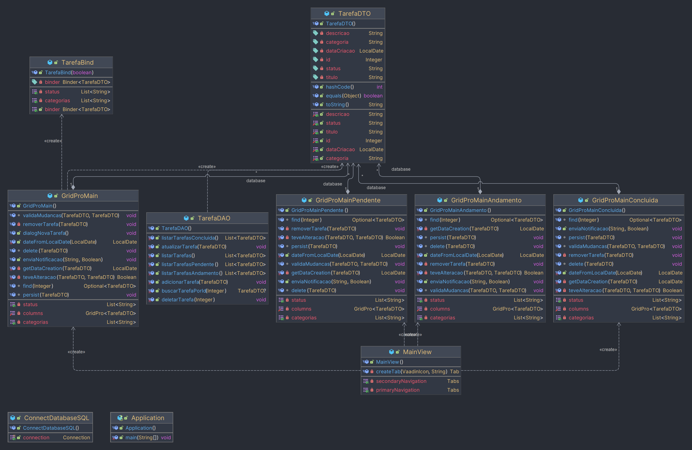

## O que eu utilizei?

As conexões ou fabrica de conexão que nem o professor nos ensinou, foi pego o exemplo que foi passado em sala de aula. e em relação ao Vaadin, 
tudo que a gente fez foi meio que apredendo na hora e tentando entender o que cada componente servia e como poderiamos utilizar ele.
Foi um pouco dificil pois não tinha muita coisa sobre ele na internet então passamos um bom tempo lendo a documentação oficial e tentamos entender.
<br>

## Caso de Uso: Agendador de tarefas

### Agendador de Tarefas Simples

Este é um agendador de tarefas simples que permite aos usuários criar, editar, remover e atualizar tarefas. Além disso, oferece a capacidade de visualizar tarefas em abas separadas, incluindo todas as tarefas, tarefas pendentes, tarefas concluídas e tarefas em andamento.

## Funcionalidades

- **Criar Tarefa**: Adicione novas tarefas ao agendador.
- **Editar Tarefa**: Modifique as informações de uma tarefa existente.
- **Remover Tarefa**: Exclua tarefas do agendador.
- **Atualizar Tarefa**: Atualize o status de uma tarefa para concluída ou em andamento.
- **Listar Todas as Tarefas**: Veja uma lista de todas as tarefas no agendador.
- **Listar Tarefas Pendentes**: Visualize apenas as tarefas pendentes.
- **Listar Tarefas Concluídas**: Veja apenas as tarefas que foram concluídas.
- **Listar Tarefas em Andamento**: Exiba somente as tarefas que estão em andamento.
- 
## Query
```sql

CREATE DATABASE IF NOT EXISTS agendadorTarefas;
USE agendadorTarefas;

CREATE TABLE IF NOT EXISTS tarefas (
                                     id INT AUTO_INCREMENT PRIMARY KEY,
                                     titulo VARCHAR(255) NOT NULL,
  descricao TEXT,
  categoria VARCHAR(255),
  dataCriacao DATE NOT NULL,
  status VARCHAR(255)
  );

INSERT INTO tarefas (titulo, descricao, categoria, dataCriacao, status) VALUES
                                                                          ('Reunião com o Cliente', 'Preparar apresentação para a reunião com o cliente X Corp. Discutir os requisitos do projeto e definir o escopo.', 'Reuniões', '2023-09-30', 'Em andamento'),
                                                                          ('Desenvolver Plano de Projeto', 'Criar um plano detalhado para o projeto de desenvolvimento do sistema de gerenciamento de estoque. Incluir cronograma, orçamento e recursos necessários.', 'Projetos', '2023-09-30', 'Pendente'),
                                                                          ('Treinamento da Equipe', 'Conduzir treinamento de equipe para a nova ferramenta de gerenciamento de projetos. Certificar-se de que todos os membros da equipe estejam familiarizados com a ferramenta.', 'Treinamento', '2023-09-30', 'Concluída'),
                                                                          ('Pesquisa de Mercado', 'Realizar pesquisa de mercado para identificar tendências e preferências dos clientes. Analisar os dados coletados e preparar um relatório.', 'Pesquisa', '2023-09-30', 'Em andamento'),
                                                                          ('Atualização de Documentação', 'Revisar e atualizar a documentação do sistema existente. Adicionar novos recursos e corrigir erros. Manter um registro de todas as mudanças.', 'Manutenção', '2023-09-30', 'Pendente');


```

### Diagrama de classes


## Informações

*Banco de dados* : MySQL;
<br>
*JDBC* : Mysql Connector 8.0.30;
<br>
*JAVA* : OpenJDK 20;
